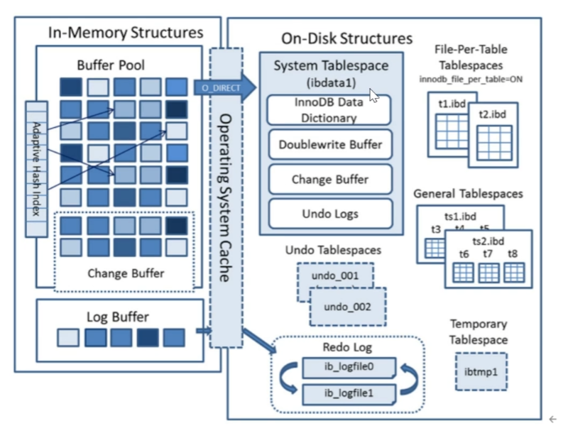
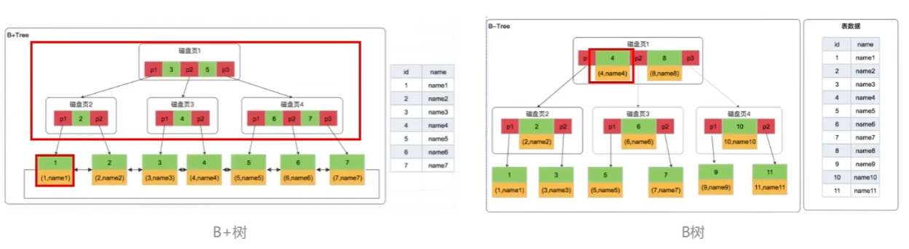
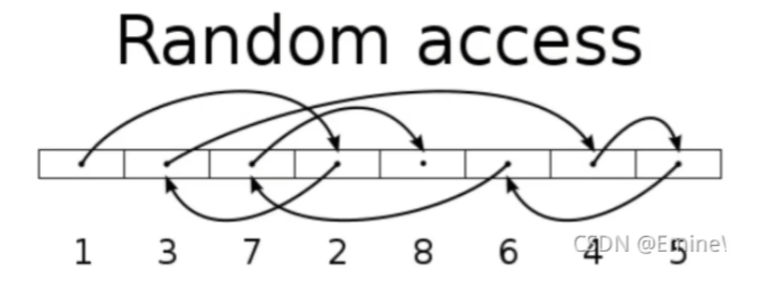
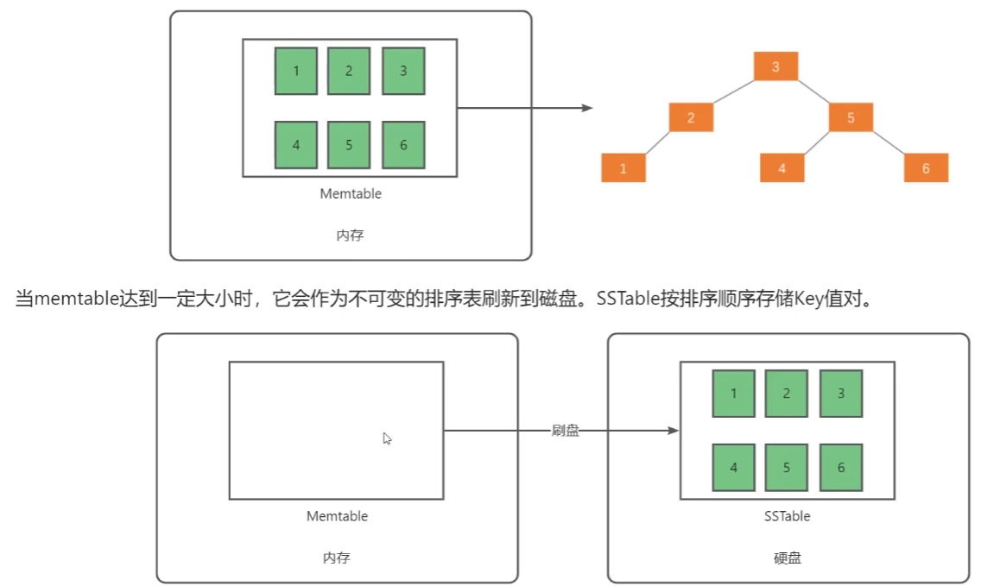
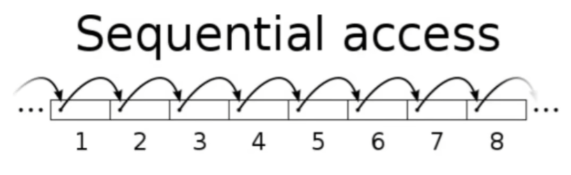
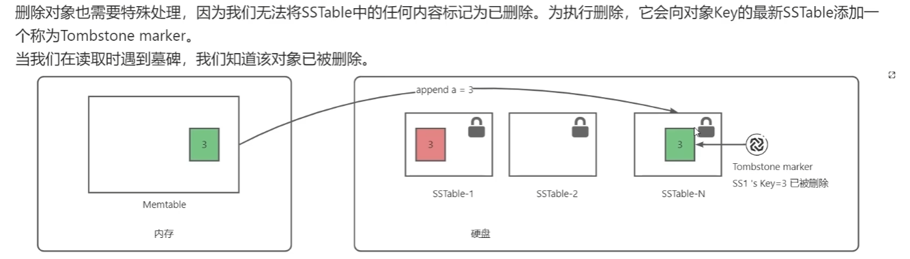
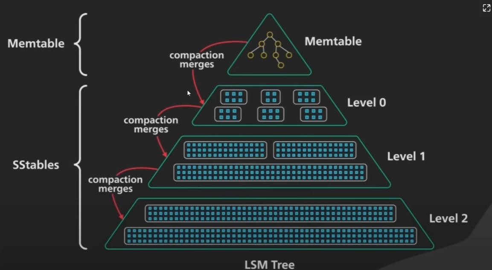

# MySQL
## InnoDB
https://www.bilibili.com/video/BV1e841167Ba  
从5.5开始默认InnoDB存储引擎, 擅长处理事务.  
### 架构
内存结构in-memory和磁盘on-disk

#### 内存
1. Buffer Pool: 
2. Change Buffer
3. Log Buffer
4. Adaptive Hash index: 自适应哈希索引, truncate?  
## 索引数据结构
MySQL默认的索引数据结构是B+树  

***Q:B+树和B树的区别?*** 

1. B树数据存在所有节点，B+树数据存在叶子节点. 
   1. B树组织节点不会出现在叶子节点上.
   2. B+树由于路径节点不存数据，因此可以存储更多的节点，从而减少树高度，加快查找.
2. B+树在叶子节点上有双向链表，一个节点快速定位到下一个节点.
   1. 更好支持范围查询和排序.

***Q:B+树和LSM树的区别?***  
https://www.bilibili.com/video/BV18A411B7YY  
核心: 读优化和写优化的区别.  
1. B+树对读取进行优化，但是写入代价高，因为涉及随机IO、并且可能包括更新磁盘上的多个page.

2. LSM树针对快速写入进行了优化, 生成数据后写入内存中的memtable, 插入时就完成平衡二叉树排序, 然后刷到SSTable硬盘.  

写入是顺序IO:

由于SSTable不可变，需要加入Tombstone marker机制:

为了解决过时条目增多造成的磁盘浪费和性能劣化, 需要后台做周期性合并和压缩:  

有两种广泛的策略:
   1. SizeTieredCompaction, 偏向写入吞吐量优化
   2. LeveledCompaction, 偏向读取优化

## 并发
解决并发事务（多线程同时请求相同数据）产生的问题:  
1. 脏读, e.g. 读未提交而回滚
2. 不可重复读,  e.g. 事务两次读之间另一个事务修改
3. 幻读, e.g. 主要是针对由insert影响的范围/整表，例如求和、求符合区间条件的总条目数
### 隔离级别
数据库通过MVCC提供四种隔离级别：
1. RU读未提交
2. RC读已提交 -> MVCC解决脏读, 每次查询创建视图. 
3. RR可重复读 -> MVCC解决不可重复读, 首次查询创建视图. 
4. SR串行化 -> 解决幻读  
   注意，这里是从MVCC角度讨论解决问题的，实际实现中还有锁协助.
### MVCC
Multi Version Concurrency Control, 多版本并发控制器. 事务隔离级别的***无锁***的实现形式, 用于提高事务的并发性能.
1. 3个隐藏列, DB_ROLL_PTR指向老数据，存在undolog(TODO)
2. ReadView视图(TODO)
### InnoDB锁

## 慢SQL优化思路
1. 索引设计
   1. 加了吗, 加全了吗?
   2. 筛选度够吗?
   3. 生效了吗? 字符集, 转换
2. 查询方式
   1. 减少SELECT *, 消耗资源且容易回表
   2. 小表驱动大表
   2. values批量操作
   3. limit限制数量, 同时也要注意不要深度分页